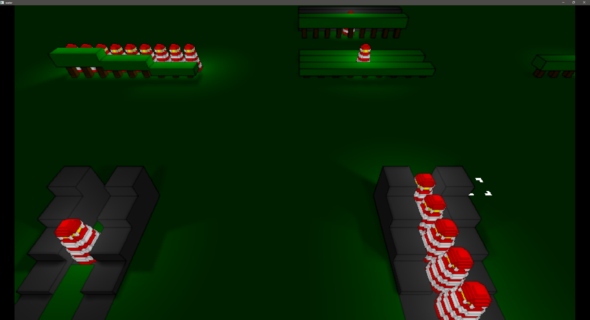

# 2.5D Lighting Prototype

Tiny isometric lighting prototype using raycasting (WIP).
Combines an isometric and top-down orthographic view to support point shadows that only require three renders of the world.

*~20 point shadows running at 768x432 in real-time at ~60 FPS with "SSAO" and sun shadows using a PCF kernel of 2, 4 and 2, respectively (on integrated Radeon Graphics)*